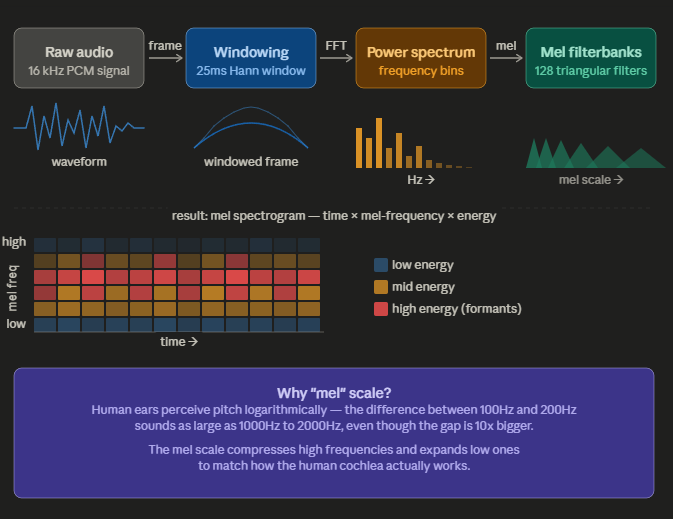
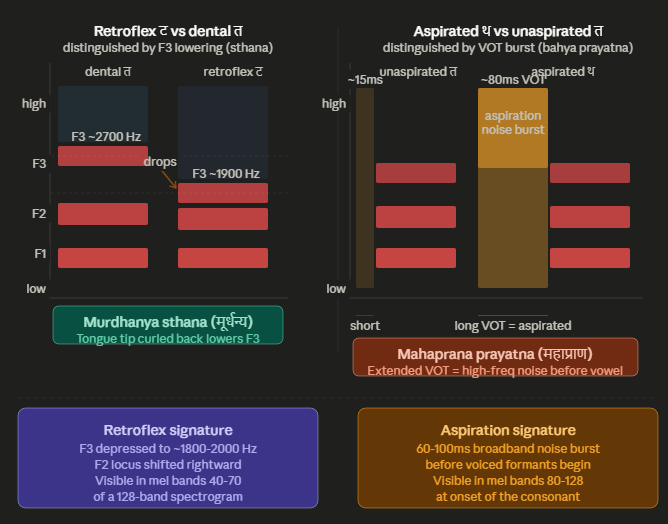
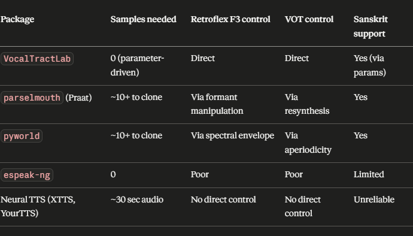

<-- Claude assisted improvement -->
# Whisper is NOT end-to-end audio tokenization
It has two completely separate pipelines:
## ENCODER SIDE (fixed, no text tokens)
Audio MP3 ──► Log-Mel Spectrogram ──► Encoder ──► Hidden States
                        ↑
              This never changes. Always
              128 mel bins at 16kHz.
              No vocabulary involved.

## DECODER SIDE (this is where tokens matter)
Hidden States ──► Decoder ──► Text Tokens ──► "अर्जुन उवाच..."
                                   ↑
                       THIS is what you're improving
                       by adding Sanskrit tokens

# Improving flow

1. Expand Text Tokens
``` python
# Step 1 — Expand the text tokenizer (decoder side)
new_tokens = ["ॐ", "श्लोक", "अर्जुन", "कृष्ण", "धर्म"]
processor.tokenizer.add_tokens(new_tokens)

# Step 2 — Resize model embeddings to match new vocab
model.resize_token_embeddings(len(processor.tokenizer))

# Step 3 — Fine-tune with your Sanskrit audio dataset
# Audio side stays exactly the same — 16kHz log-mel spectrogram
```

Why this matters practically
Without Sanskrit tokens, a word like कृष्ण gets broken into many small byte-level pieces:
# Before adding tokens (poor)
"कृष्ण" → ["▁क", "ृ", "ष", "्", "ण"]  — 5 tokens, inefficient

# After adding tokens (good)
"कृष्ण" → ["कृष्ण"]  — 1 token, clean
More tokens = more steps for the decoder = higher chance of errors in transcription and language detection.

2. Articulatory Synthesis to change mel spectrogram training
``` python

# Conceptual pipeline
# 1. Define Sanskrit phoneme articulations
phonemes = {
    "ट": {"tongue": "retroflex", "voiced": False, "aspirated": False},
    "थ": {"tongue": "dental",    "voiced": False, "aspirated": True},
    "ण": {"tongue": "retroflex", "voiced": True,  "nasal": True},
}

# 2. Use a synthesizer like Praat or a VTL (Vocal Tract Lab) model
# to generate audio from articulation parameters

# 3. Convert synthesized audio → mel spectrogram → training data
import librosa
import numpy as np

def audio_to_mel(audio, sr=16000, n_mels=128):
    mel = librosa.feature.melspectrogram(y=audio, sr=sr, n_mels=n_mels)
    return librosa.power_to_db(mel, ref=np.max)
```
Practical tools you can use:
Tool                | What it does
praat-parselmouth   | Python bindings for Praat — industry standard for phonetic synthesis
pysptkSpeech        | signal processing toolkit — formant manipulation
VocalTractLab       | Physics-based vocal tract simulator
espeak-ng           | Supports Sanskrit (sa) — fast but less realistic

2.1 Ver 1: Improving conceptual flow
`pip install praat-parselmouth pysptk
``` python
import parselmouth
from parselmouth.praat import call

# Generate a Sanskrit vowel with specific formant targets
# F1/F2 values for Sanskrit 'अ' (open central vowel)
sound = call("Create Sound from formula", "a", 1, 0, 0.5, 16000,
             "0.4*sin(2*pi*120*x)")  # fundamental frequency

# Manipulate formants to match Sanskrit vowel targets
manipulation = call(sound, "To Manipulation", 0.01, 75, 600)
```

2.2 Ver 2: Low sample, physics based
``` python 
import parselmouth
from parselmouth.praat import call
import pyworld as pw
import numpy as np
import soundfile as sf

# ── Step 1: Load a real sample (your ~10-99 recordings) ──────────────────────
audio, sr = sf.read("ta_dental.wav")  # त recording
audio = audio.astype(np.float64)

# ── Step 2: WORLD analysis — decompose into controllable components ──────────
f0, sp, ap = pw.wav2world(audio, sr)   # sp = spectral envelope = where formants live
                                        # ap = aperiodicity = where aspiration noise lives
                                        # f0 = pitch contour

# ── Step 3: Synthesize RETROFLEX ट from dental त ────────────────────────────
# Lower F3 by shifting spectral envelope in the 2000-2800 Hz region downward
def lower_F3(sp, sr, shift_hz=-700):
    """Warp spectral envelope to simulate retroflex F3 lowering."""
    n_bins = sp.shape[1]
    freqs = np.linspace(0, sr / 2, n_bins)
    sp_retroflex = np.copy(sp)
    
    # Find bins in F3 region (~2000-3000 Hz) and shift energy downward
    f3_region = (freqs > 1800) & (freqs < 3200)
    shift_bins = int(abs(shift_hz) / (sr / 2 / n_bins))
    
    for t in range(sp.shape[0]):
        sp_retroflex[t, f3_region] = np.roll(sp[t, f3_region], shift_bins)
    return sp_retroflex

sp_retroflex = lower_F3(sp, sr, shift_hz=-700)
audio_retroflex = pw.synthesize(f0, sp_retroflex, ap, sr)
sf.write("ta_retroflex_synth.wav", audio_retroflex, sr)

# ── Step 4: Synthesize ASPIRATED थ from unaspirated त ───────────────────────
# Insert broadband aspiration noise before the vowel onset (extend VOT)
def add_aspiration(audio, sr, vot_ms=80):
    """Prepend VOT aspiration noise burst to simulate mahaprana."""
    vot_samples = int(vot_ms * sr / 1000)
    
    # Generate shaped aspiration noise (high-frequency, decaying)
    noise = np.random.randn(vot_samples) * 0.08
    
    # Shape noise with envelope — strong at onset, fades into vowel
    envelope = np.exp(-np.linspace(0, 3, vot_samples))
    aspiration = noise * envelope
    
    # High-pass filter to make it breathy (aspiration is mostly above 2kHz)
    from scipy.signal import butter, filtfilt
    b, a = butter(4, 2000 / (sr / 2), btype='high')
    aspiration = filtfilt(b, a, aspiration)
    
    return np.concatenate([aspiration, audio])

audio_aspirated = add_aspiration(audio, sr, vot_ms=80)
sf.write("tha_aspirated_synth.wav", audio_aspirated, sr)
```

# FAQ 
## What is a mel spectrogram?
A mel spectrogram is a 2D image of sound — the x-axis is time, the y-axis is frequency (on the mel scale), and the color/brightness is energy. Whisper treats this image exactly like a CNN would treat a photo — the encoder is essentially a vision model that reads audio.
The pipeline is: raw audio → slice into overlapping 25ms frames → apply FFT to get frequencies per frame → pass through 128 triangular "mel filterbanks" that compress high frequencies → take the log → stack frames side by side → you get a 128 × N_frames matrix. That matrix is what Whisper's encoder actually sees.



## How articulatory synthesis could improve it
This is a genuinely advanced idea. Here's what it means and why it matters for Sanskrit/GitaWhisper:
_The problem:_ 
Whisper was trained mostly on Western languages. Sanskrit has phonemes — like retroflex consonants (ट, ड, ण) and aspirated stops (थ, ध, फ) — that produce mel spectrogram patterns Whisper has rarely seen. Its encoder doesn't recognize the distinctive formant shapes these produce.

_What articulatory synthesis does:_ 
Instead of recording real humans, you simulate the vocal tract physically — tongue position, lip shape, velum opening — to generate acoustically precise audio for any phoneme. The output is audio that can then be converted to mel spectrograms for training.

_Why this specifically helps GitaWhisper_
Sanskrit is a highly phonemic language — two words can differ by a single aspiration or retroflex. Articulatory synthesis lets you generate thousands of minimal pairs (e.g. त vs थ, द vs ध) with perfectly controlled acoustic variation, giving the decoder many examples of those formant patterns without needing hundreds of hours of real recordings.
The synthesized mel spectrograms fill gaps in your training data that no amount of real-world audio collection could easily cover for a classical language with limited speakers.

## Can Mel Spectrogram capture the Sanskrit  प्रयत्न model?
Yes — but through completely different acoustic signatures. The Prayatna model maps directly to specific mel spectrogram regions: 


The Prayatna system maps onto mel spectrograms with remarkable precision. The two contrasts live in completely different parts of the spectrogram — F3 lowering is a mid-frequency spatial shift, while aspiration is a temporal burst at high frequencies before the vowel even starts. This means a model CAN learn to distinguish them, but **only if it has enough training examples** showing both patterns clearly.

## Which synthesis package can capture these from ~10-99 samples?
This is the critical constraint — and it rules out most neural approaches entirely. With fewer than 100 samples, you need physics-first tools that generate from articulatory parameters, not from learned data distributions.


_Honest recommendation for GitaWhisper_
Given your small sample size, use **pyworld + parselmouth** together — WORLD gives you precise control over the spectral envelope (retroflex) and aperiodicity (aspiration), while Praat lets you verify and fine-tune with a visual phonetic tool. From 20 samples you can generate thousands of phonetically varied training examples covering the **full Prayatna matrix of sthana × prayatna combinations**.

**VocalTractLab** is the most theoretically correct choice since it models the vocal tract geometry that the Prayatna system literally describes, but it has a steeper setup curve. Save it for phase 2 once the parselmouth pipeline is working.

